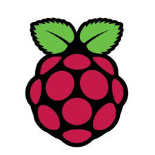

# Hardware

## Raspberry Pi

I bought a CanaKit Raspberry Pi 3 B+ (B Plus) Complete Starter Kit (16 GB Edition, Premium Clear Case) from [Amazon](https://www.amazon.com/gp/product/B07BLRSKBV/). However later I found there are better buying options on Amazon since not all pieces in the complete starter kit are useful. Its spec are listed in the following table

| Tables        | Are           | Cool  |
| ------------- |:-------------:| -----:|
| col 3 is      | right-aligned | $1600 |
| col 2 is      | centered      |   $12 |
| zebra stripes | are neat      |    $1 |

I installed the board in the case, and connected it with a mouse, a keyboard, and a monitor.

I powered it on, and installed the OS that is preloaded in the micro SD card that comes with the starter kit.

