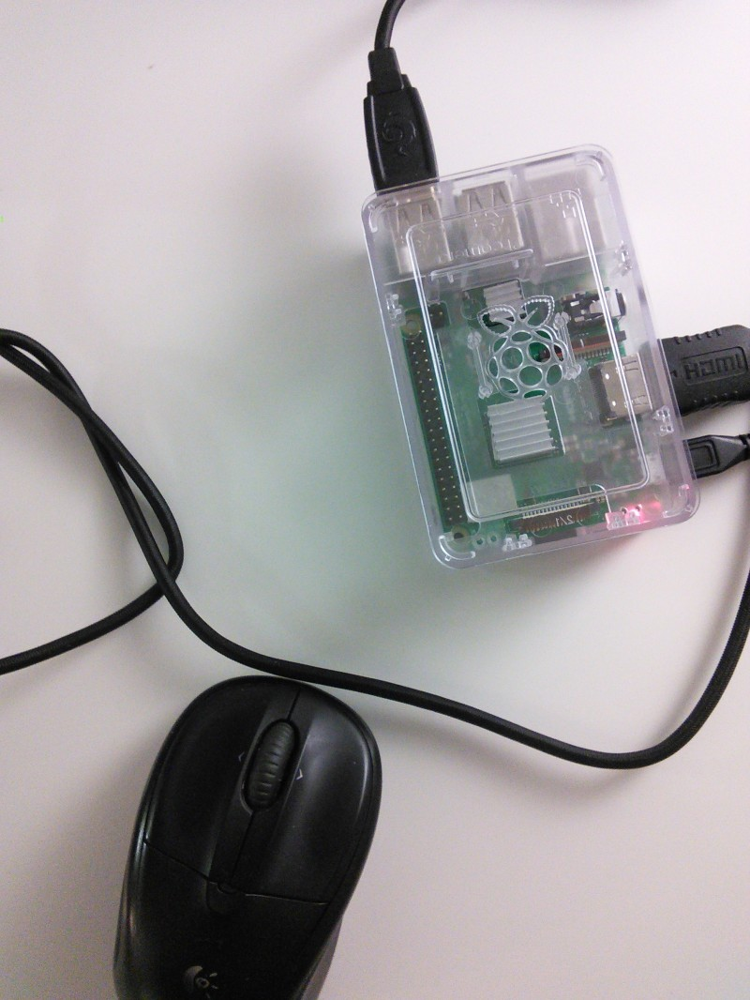

# Hardware

## Raspberry Pi

I bought a CanaKit Raspberry Pi 3 B+ (B Plus) Complete Starter Kit (16 GB Edition, Premium Clear Case) from [Amazon](https://www.amazon.com/gp/product/B07BLRSKBV/). However later I found there are better buying options on Amazon since not all pieces in the complete starter kit are useful. Its spec are listed in the following table

|   |   |
---|---
CPU           | quad-core, 1.4GHz 
RAM           | 1GB               
Storage       | 16G Micro-SD  

One can run commands such as `cat /proc/meminfo`, `free -m`, `gpio -v`, `df -h` and etc. to check the hardware specs. Note that `Hardware` in the output of `cpuinfo` is always `BCM2835` for different RPI boards. The `Revision` number (mine is `a020d3`) is useful to determin the version of the board.

I installed the board in the case, and connected it with a mouse, a keyboard, and a monitor.

I powered it on, and installed the OS that is preloaded in the micro SD card that comes with the starter kit.

sudo apt-get install libblas-dev liblapack-dev python-dev \
libatlas-base-dev gfortran python-setuptools
sudo ​pip2 install \
http://ci.tensorflow.org/view/Nightly/job/nightly-pi/304/artifact/output-artifacts/tensorflow-1.9.0rc0-cp27-none-linux_armv7l.whl
