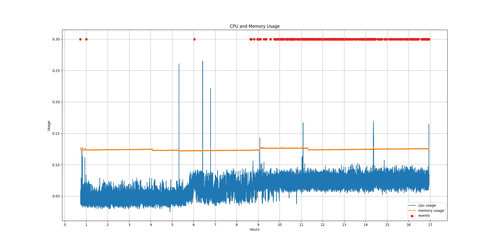
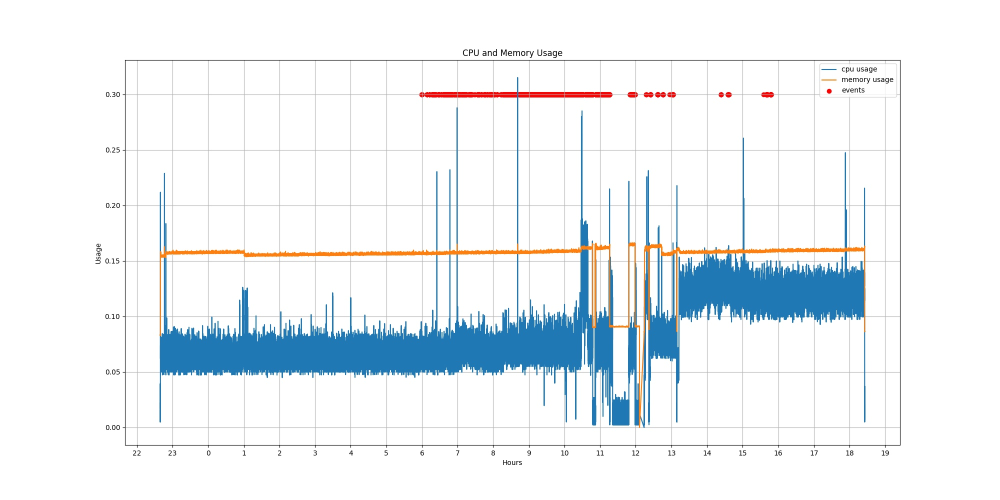

The above figure shows the CPU and memry usages for over 17 hours while Motion was running and saving detected events. The configuration of Motion is [here](motion_configs/motion-2018-07-15.conf). Note that `output_pictures` is set to `best` which is more CPU intensive compared to other modes.

Both CPU and memory usage are within reasonable range. 

Memory usage is pretty flat. 

While a lot of events were detected, CPU usage increases a little bit (compare the CPU usage before hour 9 and after hour 9). The Pi Camera is not IR camera, so before sunrise (hour 6), it barely captures anything , so its CPU usage is lower compared to after hour 6.

The above figure shows the CPU and memory usages for over 19 hours while [test_cv.py](test_cv.py) was running. This script computes background using a MoG model.

OpenCV consumes more memory and CPU compared to motion.

The drop between 11am and 12pm is because OpenCV was shutdown.

The increase in CPU usage after 1pm is because more demanding OpenCV functions are used, while memory usage us stable.
