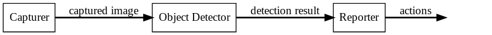

* Capturer controls the camera installed in Raspberry pi and takes a photo and saves it to the given path
* Object Detector takes an captured image as the input, and outputs detection result. Detection result includes a list of tuples. Each tuple includes object id, confidence score, and bounding box.
* Reporter analyzes detection results, and takes actions.
